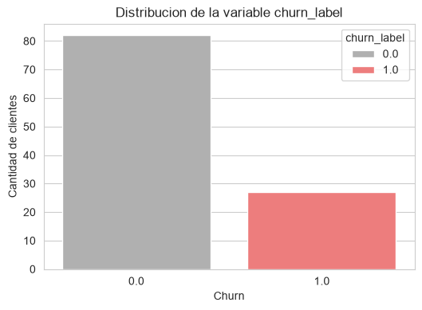
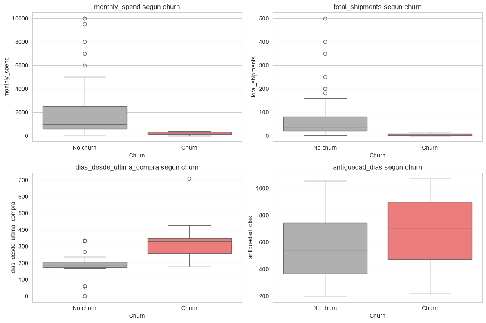
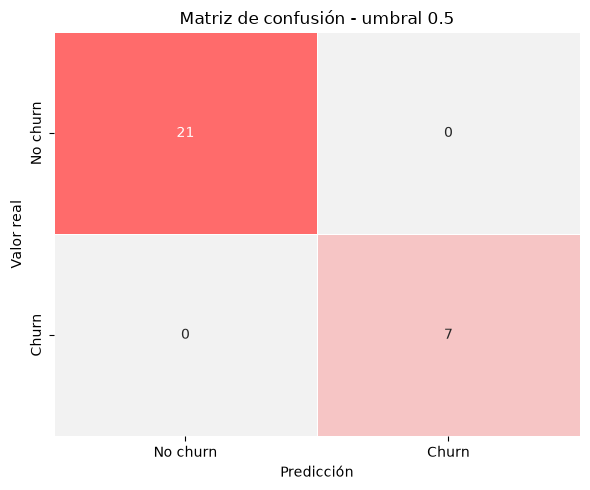
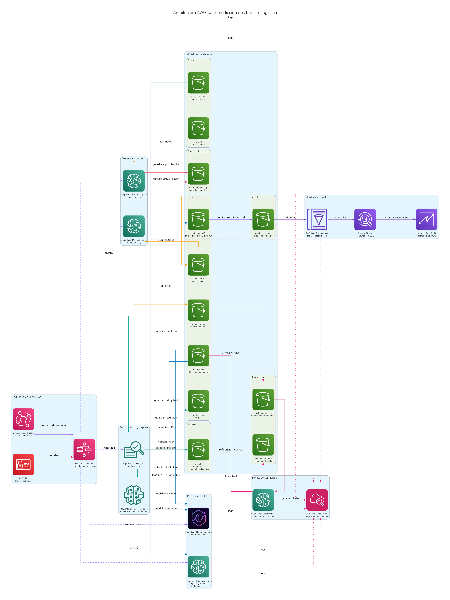

# Prediccion de churn de clientes en logistica

Este proyecto desarrolla una solucion para identificar clientes con riesgo de abandono a partir de un dataset historico de comportamiento. El trabajo comienza con datos crudos que contienen valores nulos, duplicados, formatos de fecha inconsistentes y datos personales que no deben llegar al modelo.

El repositorio conserva los notebooks utilizados durante la exploracion y, al mismo tiempo, organiza las funciones y scripts necesarios para ejecutar el proceso de forma reproducible. Tambien incluye una propuesta de arquitectura en AWS para llevar el flujo a un entorno productivo.

## Objetivo

El objetivo es estimar la probabilidad de `churn` de cada cliente y generar un resultado que pueda utilizarse para priorizar acciones de retencion. La solucion cubre tres partes:

- limpieza, validacion y anonimizacion de los datos;
- creacion de variables y entrenamiento de modelos de clasificacion;
- diseño de un flujo en AWS para procesamiento, entrenamiento e inferencia por lotes.

## Estructura del proyecto

```text

prueba/
├── 02_QA_features_modeling/       # Punto 2: anomalias y Data Leakage
├── database/                      # Se crea localmente para almacenar los datos
│   ├── bronze/                    # Datos crudos historicos y nuevos
│   ├── silver/                    # Datos limpios, features, train y test
│   ├── gold/                      # Predicciones finales
│   └── secure/                    # Relacion restringida de identificadores
├── deploy/                        # Ejecucion de trabajos en SageMaker
│   ├── ejecutar_limpieza_sagemaker.py
│   ├── ejecutar_features_sagemaker.py
│   ├── ejecutar_entrenamiento_sagemaker.py
│   ├── ejecutar_predicciones_sagemaker.py
│   ├── construccion_model.py
│   ├── inference.py
│   └── requirements.txt
├── diagrams/                      # Diagrama AWS y codigo para generarlo
├── documents/                     # Desarrollo escrito de los puntos 1 y 3
│   ├── criterio_estadistico_formulacion_problema.md
│   └── Arquitectura_MLOps_IAGenerativa.md
├── model/                         # Modelo candidato entrenado localmente
├── notebooks/                     # Desarrollo progresivo del analisis
├── scripts/                       # Ejecucion local de cada etapa
│   ├── limpieza_run.py
│   ├── features_run.py
│   ├── model_run.py
│   ├── predictions_run.py
│   └── requirements.txt
├── src/                           # Funciones utilizadas por los scripts
├── .gitignore
├── README.md
└── requirements.txt               # Dependencias del entorno local
```

Los notebooks muestran como se desarrollo el analisis y los scripts permiten repetir el flujo sin depender de ellos. Las carpetas dentro de `database/` se generan durante la ejecucion y los archivos sensibles de `database/secure/` no se publican en GitHub.

## Decisiones de limpieza

La limpieza se realizo antes de crear las variables del modelo, pero la imputacion se dejo dentro de los pipelines de entrenamiento para evitar fuga de informacion.

### Estandarizacion de valores nulos

Se encontraron distintas representaciones de ausencia, como cadenas vacias, `NA`, `N/A`, `null`, `None` y otros textos equivalentes. Todos estos valores se convierten en `NaN` para tratarlos de manera consistente.

Los registros no se eliminaron solamente por tener variables predictoras nulas. Descartarlos habria reducido una muestra que ya es pequeña y podria eliminar informacion util. En el caso de `monthly_spend`, ademas, se creo la variable `monthly_spend_is_null` porque el patron de ausencia puede aportar informacion al modelo.

### Fechas con formatos diferentes

Las fechas con guiones siguen el formato `AAAA-MM-DD`. Para las fechas con barras se revisaron los componentes: cuando el primer valor es mayor que 12 se interpreta como dia; en los demas casos se utiliza el formato mes/dia/año. Esta regla evita intercambiar el mes y el dia en valores como `03/25/2025`, que solamente puede interpretarse como mes/dia/año.

Las fechas que no pueden convertirse se conservan como `NaT`. Si la ultima compra queda antes de la fecha de registro, tambien se considera una inconsistencia y se reemplaza por un valor nulo.

### Duplicados

Los duplicados se revisaron por `customer_id`. Cuando un cliente aparece mas de una vez se conserva el registro con mayor cantidad de informacion disponible, en lugar de eliminar filas sin revisar su completitud.

El dataset pasa de 114 registros crudos a 109 clientes despues de resolver duplicados y retirar registros sin variable objetivo.

### Privacidad y anonimizacion

Las variables `full_name`, `email`, `phone` y `home_address` se eliminan porque contienen informacion personal y no son necesarias para predecir churn. El identificador original se reemplaza por `customer_id_anonymous`.

La relacion entre el ID original y el ID anonimo debe guardarse fuera de las capas analiticas, por ejemplo en una ruta privada como:

```text
database/secure/id_mapping/customer_ids.csv
```

En AWS esta equivalencia se almacenaria en una ubicacion restringida de S3, cifrada y accesible solamente mediante un rol de IAM autorizado.

### Valores inconsistentes y atipicos

Los valores de negocio claramente invalidos se convierten en nulos, en lugar de reemplazarlos por un numero arbitrario. Los valores extremos que siguen siendo posibles no se eliminan automaticamente: primero se analizan y luego se utilizan tratamientos robustos dentro del modelo.

La imputacion por mediana se eligio como alternativa base porque las variables numericas presentan asimetria y valores extremos. Tambien se compara una imputacion KNN, que utiliza clientes con caracteristicas cercanas. Todas las imputaciones se ajustan exclusivamente con los datos de entrenamiento.

## Feature engineering

A partir de las fechas se construyeron dos variables:

- `antiguedad_dias`: dias transcurridos desde el registro del cliente;
- `dias_desde_ultima_compra`: dias desde su compra mas reciente.

Tambien se agrego `monthly_spend_is_null` para conservar el posible efecto del dato faltante. El identificador anonimo se mantiene para relacionar las predicciones con cada cliente, pero no se utiliza como entrada del modelo.

Para calcular las variables temporales se tomó como fecha de referencia la última fecha de compra disponible en el dataset. Esta decisión permite establecer un punto de corte común para todos los clientes y medir de forma comparable su antigüedad y los días transcurridos desde su última compra. Además, evita utilizar la fecha actual, que podría cambiar los resultados cada vez que se ejecute el análisis. En un entorno productivo, esta fecha debe conservarse como parte de la versión del modelo o recibirse como parámetro, garantizando que la misma referencia se utilice durante el entrenamiento y la inferencia.

## Principales hallazgos del análisis

La variable objetivo presenta desbalance, por lo que la evaluación prioriza PR-AUC, recall y F1, además de utilizar una división estratificada.



Los clientes con churn muestran menor gasto y menor cantidad de envíos, junto con una mayor cantidad de días desde la última compra. Estas diferencias respaldan el uso de las variables seleccionadas para el modelo.



El modelo seleccionado presentó un buen desempeño sobre el conjunto de prueba. Sin embargo, el resultado debe interpretarse con precaución porque el test contiene solamente 28 clientes.




## Modelado

Se compararon tres algoritmos:

1. Regresion logistica como modelo base e interpretable.
2. Random Forest.
3. XGBoost.

Se evaluaron dos estrategias de tratamiento:

- imputacion por mediana y ponderacion de clases;
- imputacion KNN, transformacion logaritmica para gasto y envios, escalado robusto y SMOTE.

La division entre entrenamiento y prueba se hizo de forma estratificada, debido a que hay 82 clientes sin churn y 27 con churn en el dataset limpio. La seleccion del modelo se realiza con validacion cruzada estratificada de cinco particiones sobre `X_train`.

La seleccion utiliza una puntuacion combinada con 50% de PR-AUC, 30% de recall y 20% de F1. PR-AUC permite evaluar mejor la clase minoritaria, recall ayuda a reducir los clientes con churn que no son detectados y F1 mantiene un equilibrio con la precision. La desviacion del PR-AUC se usa como criterio de estabilidad entre las particiones.

El conjunto de prueba contiene 28 clientes y se mantiene separado durante la comparacion de alternativas. La evaluacion registrada obtuvo una clasificacion perfecta de 21 clientes sin churn y 7 con churn. Este resultado es favorable, pero debe tomarse con precaucion por el tamaño reducido del test y debe confirmarse con mas datos y seguimiento en produccion.

## Como ejecutar el proyecto

### 1. Clonar el repositorio

```powershell
git clone https://github.com/Kbernalr/analisis_churn_de_cliente_data_science_aws.git
```

Los comandos de las siguientes secciones se ejecutan desde la raiz del repositorio.

### 2. Crear el entorno local

En Windows PowerShell:

```powershell
python -m venv venv
.\venv\Scripts\Activate.ps1
python -m pip install --upgrade pip
pip install -r requirements.txt
```

Graphviz solo es necesario si se quiere volver a generar el diagrama de arquitectura.

### 3. Ejecutar el flujo local

```powershell
python scripts/limpieza_run.py
python scripts/features_run.py
python scripts/model_run.py
python scripts/predictions_run.py --input-data database/silver/model_data/test_data_customers.csv --output-data database/gold/predictions_data/predicciones_test_data_customers.csv
```

Cada script tambien permite cambiar las rutas mediante argumentos. Para consultarlos:

```powershell
python scripts/limpieza_run.py --help
python scripts/features_run.py --help
python scripts/model_run.py --help
python scripts/predictions_run.py --help
```

### 4. Procesar datos nuevos localmente

Los datos nuevos deben pasar por las mismas reglas de limpieza y creacion de variables antes de cargarse al modelo. Un ejemplo del flujo es:

```powershell
python scripts/limpieza_run.py --input-data database/bronze/raw_data_new/nuevos_clientes.csv --output-data database/silver/new_data/nuevos_clientes_limpios.csv --output-ids database/secure/id_mapping/customer_ids_new.csv

python scripts/features_run.py --input-data database/silver/new_data/nuevos_clientes_limpios.csv --output-data database/silver/new_data/nuevos_clientes_features.csv

python scripts/predictions_run.py --input-data database/silver/new_data/nuevos_clientes_features.csv --output-data database/gold/predictions_data/predicciones_nuevos_clientes.csv
```

El pipeline guardado contiene la imputacion, las transformaciones y el modelo. Por esta razon, los datos de test y los datos nuevos reciben los parametros aprendidos durante el entrenamiento; no se vuelven a calcular medianas ni escalas con esos datos.

### 5. Ejecutar el flujo en Amazon SageMaker

Para esta opcion se necesita AWS CLI v2, acceso a una cuenta de AWS, un bucket de S3 y un rol de ejecucion de SageMaker. Los scripts usan un perfil llamado `churn-python`; si se utiliza otro perfil debe cambiarse `profile_name` dentro de los archivos de `deploy/`.

Primero se crea un archivo `.env` en la raiz. Este archivo no se publica en GitHub:

```text
AWS_REGION=us-east-1
S3_BUCKET=nombre-del-bucket
SAGEMAKER_ROLE_ARN=arn:aws:iam::ID_CUENTA:role/NOMBRE_ROL
```

Se valida la identidad utilizada por Python:

```powershell
aws sts get-caller-identity --profile churn-python
```

Luego se cargan los datos y el codigo requerido por los Processing Jobs:

```powershell
$BUCKET = "nombre-del-bucket"

aws s3 cp ".\database\bronze\raw_data\raw_data_customers.csv" "s3://$BUCKET/bronze/raw_data/raw_data_customers.csv" --profile churn-python
aws s3 sync ".\src" "s3://$BUCKET/code/src/" --exclude "__pycache__/*" --profile churn-python
aws s3 sync ".\scripts" "s3://$BUCKET/code/scripts/" --exclude "__pycache__/*" --profile churn-python
```

Los trabajos se ejecutan en este orden:

```powershell
python .\deploy\ejecutar_limpieza_sagemaker.py
python .\deploy\ejecutar_features_sagemaker.py
python .\deploy\ejecutar_entrenamiento_sagemaker.py
```

El trabajo de entrenamiento imprime la ruta del artefacto `model.tar.gz`. Esta ruta se utiliza para iniciar Batch Transform. El archivo de entrada debe estar en formato JSON Lines:

```powershell
python -c "import pandas as pd; df=pd.read_csv(r'.\database\silver\model_data\test_data_customers.csv'); df.to_json(r'.\database\silver\model_data\test_data_customers.jsonl', orient='records', lines=True)"

aws s3 cp ".\database\silver\model_data\test_data_customers.jsonl" "s3://$BUCKET/silver/model_data/test_data_customers.jsonl" --profile churn-python
```

Finalmente se ejecutan las predicciones:

```powershell
python .\deploy\ejecutar_predicciones_sagemaker.py --model-data "s3://RUTA-DEL-MODELO/model.tar.gz" --input-data "s3://$BUCKET/silver/model_data/test_data_customers.jsonl" --output-data "s3://$BUCKET/gold/predictions_data/"
```

Los trabajos de procesamiento utilizan `ml.t3.medium`, mientras que Training Job y Batch Transform estan configurados con `ml.m5.large`. Antes de ejecutarlos se debe comprobar que la cuenta tenga una cuota mayor que cero para cada tipo de trabajo. Si AWS devuelve `ResourceLimitExceeded`, se debe solicitar el aumento desde Service Quotas.

## Arquitectura propuesta en AWS



La arquitectura sigue un flujo batch orientado a las capas Medallion:

- **Amazon S3:** conserva los datos crudos en Bronze, los datos limpios y las features en Silver, y las predicciones en Gold. La equivalencia entre identificadores se guarda en una ruta Secure con permisos restringidos.
- **SageMaker Processing:** ejecuta `limpieza_run.py` y `features_run.py` tanto para el historico como para los datos nuevos.
- **SageMaker Training y Model Registry:** entrenan el pipeline, almacenan `model.tar.gz` y permiten versionar y aprobar el modelo candidato.
- **SageMaker Batch Transform:** calcula semanalmente la probabilidad y la prediccion de churn para cada cliente nuevo.
- **EventBridge y Step Functions:** programan y coordinan la ejecucion del pipeline sin depender de una ejecucion manual.
- **SageMaker Model Monitor y CloudWatch:** comparan los datos nuevos con la referencia de entrenamiento y centralizan reportes, logs y alertas.
- **Glue Data Catalog, Athena y QuickSight:** catalogan las predicciones de Gold, permiten consultarlas con SQL y publicarlas en un tablero para negocio.


Para volver a generar la imagen:

```powershell
python diagrams/generate_diagrams.py
```

## Ejercicio de Calidad de Datos, Feature Engineering y Modelado

La carpeta `02_QA_features_modeling/` contiene la revision del generador de datos logisticos y la refactorizacion de `preparar_features_clientes`.

En ese ejercicio se corrigieron, entre otros puntos:

- una diferencia entre la cantidad de columnas y valores generados;
- una fecha de entrega que podia heredarse entre iteraciones;
- el codigo `99999` y los gastos negativos;
- retrasos negativos que no debian corregirse con valor absoluto;
- imputacion y escalado realizados antes de separar train y test;
- el argumento incorrecto `test_split` y la ausencia de estratificacion.

La justificacion completa se encuentra en [QA_Feature_Engineering_Modelado.md](02_QA_features_modeling/QA_Feature_Engineering_Modelado.md).

## Documentacion de Criterio Estadístico y Formulación del Problema y documentacion de Arquitectura, MLOps e IA Generativa

La carpeta `documents/` complementa el codigo con el desarrollo de los puntos conceptuales solicitados:

- **Punto 1 - Criterio estadistico y formulacion del problema:** define la fuga silenciosa en logistica, el target, las ventanas de observacion y performance, el tratamiento de reactivaciones, el sesgo de supervivencia y la relacion entre metricas de negocio y del modelo. Ver [criterio_estadistico_formulacion_problema.md](documents/criterio_estadistico_formulacion_problema.md).
- **Punto 3 - Arquitectura, MLOps e IA Generativa:** describe el scoring semanal con Step Functions, el registro del modelo, el monitoreo de Data Drift y el diseño de un asistente RAG con Amazon Bedrock y LangGraph, incluyendo control de alucinaciones y proteccion de PII. Ver [Arquitectura_MLOps_IAGenerativa.md](documents/Arquitectura_MLOps_IAGenerativa.md).


## Consideraciones antes de produccion

Antes de utilizar el modelo en un proceso real se recomienda:

- validar el desempeño con una muestra temporal mas grande;
- definir una fecha de corte comun para las variables temporales;
- usar un identificador anonimo estable para evitar colisiones entre lotes;
- versionar datos, modelo, umbral y fecha de entrenamiento;
- almacenar el mapeo de identificadores en una ubicacion cifrada y restringida;
- monitorear calidad de datos, drift, recall y falsos negativos;

## Resultado

El proyecto deja un flujo reproducible desde los datos crudos hasta la generacion de probabilidades de churn. La limpieza reduce el historico de 114 registros a 109 clientes validos, elimina las variables personales del conjunto analitico y conserva la equivalencia de identificadores en una ubicacion separada.

Para el modelado se comparan Regresion Logistica, Random Forest y XGBoost con dos estrategias de tratamiento. La seleccion no depende solamente de una metrica: combina PR-AUC, recall y F1 mediante validacion cruzada estratificada. La imputacion, el escalado, el balanceo y el modelo quedan incluidos dentro del pipeline para reutilizar exactamente las transformaciones aprendidas durante la inferencia.
